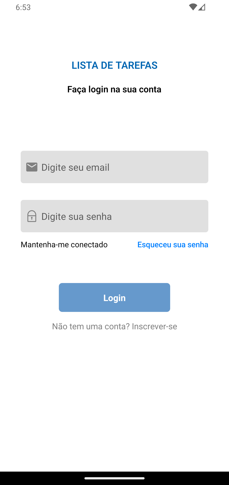

#Todo-List

# Project Full Stack

The project is still under development and the next updates will focus on the following tasks:

- ✅Add a new task
- ✅Mark and unmark a task as completed
- ✅Remove a task from the list
- ✅Save data using AsyncStorage and MongoDB
- ✅Show task completion progress
- ✅Shows the date of the day/month and year of the task you did so you don't forget when to complete the task
- ✅Appears on the profile which tasks have been completed and which are pending and shows a table of which tasks have or have not been completed and etc
- States
- Immutability of the state
- Lists and keys in React Native
- Properties
- Componentization

- - ## ⚙️ Install

For the installation of the project, follow the steps:

Clone the project:

```
https://github.com/SamuelBarbosa1/todo-list
```

Go to project path:

```
cd todo-list
```

Run the command to install all packages:

```
npm install
yarn install
```
Go to mongodb

```
package.json ""scripts": {start": "nodemon index.js",},"
cd api
yarn start
[nodemon] 3.0.3
[nodemon] to restart at any time, enter `rs`
[nodemon] watching path(s): *.*
[nodemon] watching extensions: js,mjs,cjs,json
[nodemon] starting `node index.js`
Server esta rodando na porta 3000
Conectado ao MongoDb
```

## 🚀 Running the App

After installing the packages just run the command:

```
npx expo start
```
## dependencies:
```
"@react-native-async-storage/async-storage": "1.21.0",
        "axios": "^1.6.7",
        "crypto-js": "^4.2.0",
        "expo": "~50.0.7",
        "expo-constants": "~15.4.5",
        "expo-linking": "~6.2.2",
        "expo-router": "~3.4.7",
        "expo-status-bar": "~1.11.1",
        "jsonwebtoken": "^9.0.2",
        "moment": "^2.30.1",
        "mongodb": "^6.3.0",
        "react": "18.2.0",
        "react-native": "0.73.4",
        "react-native-calendars": "^1.1303.0",
        "react-native-chart-kit": "^6.12.0",
        "react-native-gesture-handler": "~2.14.0",
        "react-native-modals": "^0.22.3",
        "react-native-safe-area-context": "4.8.2",
        "react-native-screens": "~3.29.0"
```
* ## :wrench: technologies used
<div>
 


</div>

* ## 📸 Project Pictures
<div>
  <p  align="center">
  
  
  
  
  
  
  
  </p>
</div>
